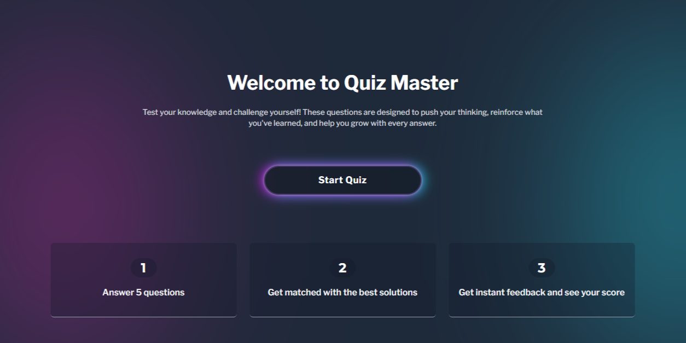
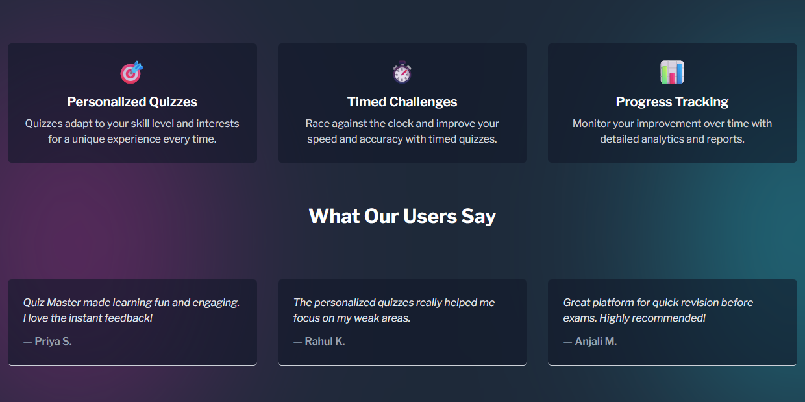
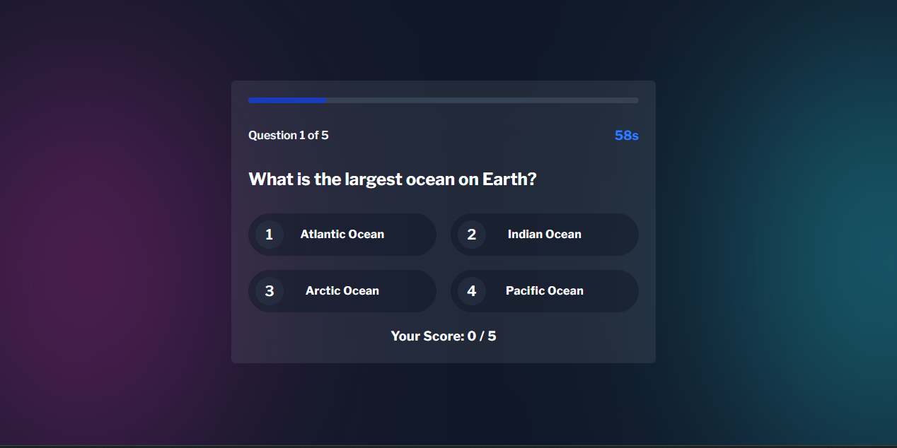
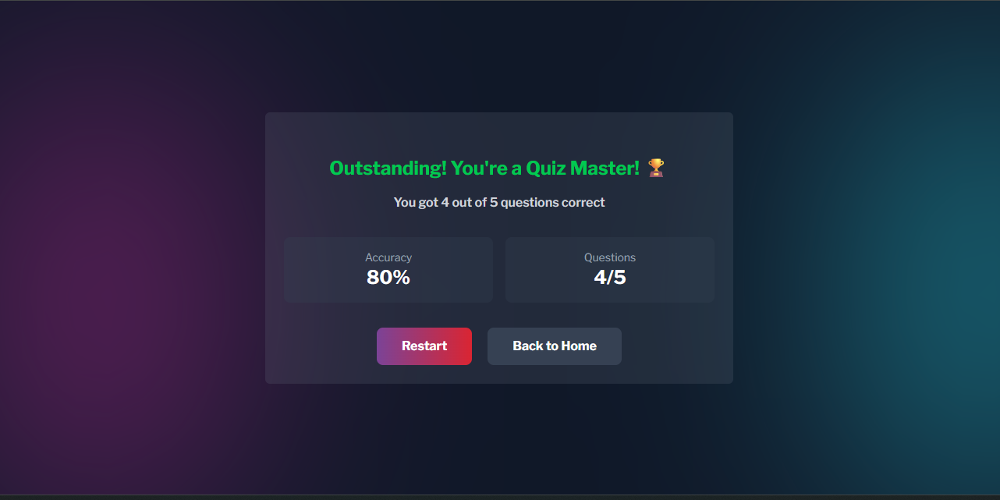

# Quiz Master

Quiz Master is a modern, interactive quiz web application built with React and Vite. It allows users to test their knowledge with personalized quizzes, timed challenges, and instant feedback. The app features smooth animations, responsive design, and a user-friendly interface.

## Features
- Personalized quizzes that adapt to your skill level
- Timed challenges to improve speed and accuracy
- Progress tracking with detailed analytics
- Instant feedback after each question
- Responsive and visually appealing UI
- Animated transitions and scroll effects

## Screenshots

### Home Page



### Quiz Page


### Result Page


## Getting Started

### Prerequisites
- Node.js (v16 or above recommended)
- npm or yarn

### Installation
1. Clone the repository:
   ```powershell
   git clone <your-repo-url>
   cd quiz-app
   ```
2. Install dependencies:
   ```powershell
   npm install
   # or
   yarn install
   ```
3. Start the development server:
   ```powershell
   npm run dev
   # or
   yarn dev
   ```
4. Open your browser and go to `http://localhost:5173` (or the port shown in your terminal).

## Project Structure
```
quiz-app/
├── public/
│   ├── home1.png
│   ├── home2.png
│   ├── quiz.png
│   ├── result.png
│   └── vite.svg
├── src/
│   ├── component/
│   ├── context/
│   ├── data/
│   ├── hooks/
│   ├── pages/
│   ├── App.jsx
│   └── main.jsx
├── package.json
├── vite.config.js
└── ...
```

## Credits
- Built with [React](https://react.dev/) and [Vite](https://vitejs.dev/)
- Animations powered by [GSAP](https://greensock.com/gsap/)

## License
This project is for educational purposes.
